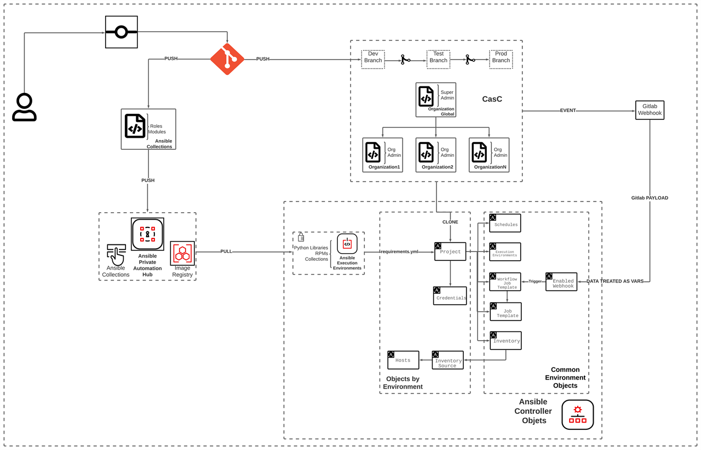
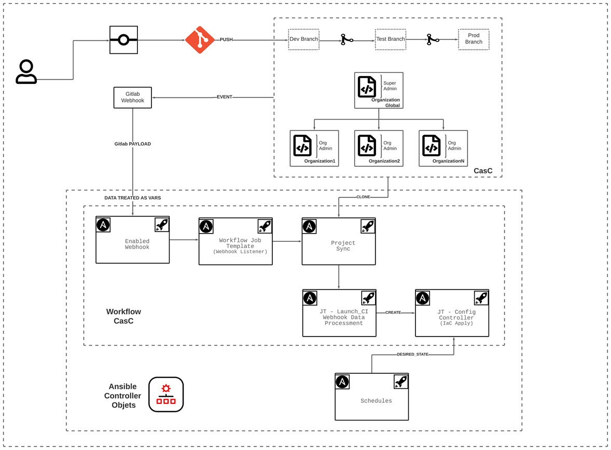

DEPRECATED -> MOVED TO https://github.com/automationiberia/controller_configuration/tree/casc-roles-automationiberia.


One of the discussions we had when we were talking about the collection desing was if the configuration approach should be called Infrastructure or Configuration as Code, so We'd like to highlight the difference between Configuration as Code vs. Infrastructure as Code.

Configuration as code (referred to as CasC or CAC) and Infrastructure as Code (IaC) are often referred to as the same thing, but IaC is about managing your IT infrastructure. This includes servers, networking, load balancing, and security.

Configuration as code is about how your software components interact with each other. If you change a setting on your application or product, it can be built and tested earlier in the pipeline and released with a higher confidence.

Now that some concepts are clear, let's summarize what the collection will do. Basically, the collection is compose by three roles:

- **controller_casc_implementation**: This role implements the collection [{tower,controller} collection](https://github.com/redhat-cop/tower_configuration/), loading the controller's objects taken from an unique source of true (SCM) , which is divided into a directory structure. We want to emphasize that the added value of this role is the way the input files are organized, which are grouped hierarchically according to the needs of the client. Also, we added a task to handle the webhook_payload to trigger the job that will apply the actions over the controller's object.
- **controller_casc_desired_state**: The role will handle the state of the Configuration as Code. Basically, the role takes advantage of the [controller_object_diff.py](https://github.com/redhat-cop/tower_configuration/blob/devel/plugins/lookup/controller_object_diff.py) lookup plugin, which compares two lists, one from the API and the other from the SCM and deletes the objects in the controller that are not defined in the SCM list.
- **controller_casc_from_aap**: This role is in charge of populating all exportable objects from the controller / tower instances  in a yaml file. The main goal of the role is to provide a baseline to create an structure of the Configuration as Code for already existing AWX, Tower or Controller instances.

Automation Webhook scan be used to link a Git repository and Ansible automation natively. Once a repo link is setup, Ansible catches events (commits: push, merge, jobs, etc) from the Git system (GitHub, GitHub Enterprise, GitLab) and uses them to automatically trigger automation jobs to update projects, inventories, and perform deployments, all without requiring yet another third-party tool such as Jenkins.

The benefits of having to use and manage the configuration of one less tool is clear. With these new capabilities, there is no need for an additional CI tool such as Jenkins to monitor repos and launch automation jobs when changes occur. There is no need to sync job parameters, manage user access and monitor activity across systems. Less moving parts means there are less things that could break and less risk of credentials leaking or your CI system being exploited to deploy things to production.

Utilizing the Automation Webhook capabilities in Ansible Tower, you can implement agentless GitOps workflows that go beyond just cloud-native systems and manage existing IT infrastructure or Configuration such as cloud services, networking gear or software configuring, which is the our case.

**AAP Workflow CasC**


*AAP Workflow CasC*

As We can see in the picture, we should have at least 3 repositories on our SCM:

1. [Repository containing the code for the ansible Collection](https://github.com/automation-ansible-collections/controller_casc): In this repo you will find the modules, roles, plugins necessary to apply our configuration as Code (CasC).
2. [Repository that contains the objects of the SuperAdmin Organization](https://github.com/automation-ansible-collections/global): In this repo, you will find the definition of all the objects, in this case the Controller of the Ansible Automation Platform.
3. [Repository that contains the objects of X Organization](https://gitlab.bcnconsulting.com/aap-demo/casc_aap/-/tree/master/roles/config_controller/tests/orgsExamples/organization1): where the owners of each organization will be responsible JUST for the objects under their organization. In other words, they will have admin privileges only of that Organization. It should be noted that some objects, such as users, teams and organizations, must be managed by a super admin, so they are managed from a "SuperAdmin Organization", which in this case we call it "GLOBAL". The ansible.controller.user ansible module is subject to change it's behaviour in the near future thanks to a [Pull Request](https://github.com/ansible/awx/pull/11655) made by [@ivarmu](https://github.com/ivarmu), where enables any Organization admin to create new users on his own organization, operation that, currently, is only allowed to a SuperAdmin.


The following components of the [Ansible Automation Platform](https://source.redhat.com/aboutredhat/messagingindex/messaging_index_wiki/mi_red_hat_ansible_automation_platform) has been used to achieved our goal:

- **Ansible Controller**: Piece in charge of the tower's API, in which we are going to apply our configuration, the necessary objects for the execution of the workflow controller.
- **Private Automation HUB**: This component will be in charge of the life cycle of the collections, roles and execution environments. This tool is provided with an Image Registry where we will upload the images that we will use in the execution environment.


Let's explain how the automation flow is executed and triggered:

- Configuration files are modified or added to an Organization repo in the Development branch.
- An event is generated in the SCM when making a commit and uploading the changes to the repo.
- This event sends through a [Payload](https://docs.ansible.com/automation-controller/latest/html/userguide/webhooks.html#payload-output) all the information related to the commit: Files that were modified, organization from where the changes are being made, etc.
- The data is treated and added as Extra Vars, which it will be used to perform actions over the Controller's objects.
- Organization objects will be cloned from the SCM repo, through the controller's projects object type. When the code is synchronized, may download collections or roles if needed. It should be noted that this is executed within an execution environment, so it is possible to either have an execution environment with all the collections, roles, modules that they need or they can create a base one and that the developers add later.


Now let's  dive a little bit deeper into the objects affected in the Controller.


**AAP Controller Workflow CasC**


*AAP Controller Workflow CasC*


The workflow will have the following steps:

- **Workflow Job Template (Controller Object)**: It's the captures the data triggering the following actions. Basically, will call Two Tasks:
  - Project Sync: It will do a git clone, and depending on whether it needs to download any collections or roles that it doesn't have in the execution environment, it will do so at this point.
  - Job Template - Launch CI: The data sent from through the [payload](https://docs.ansible.com/automation-controller/latest/html/userguide/webhooks.html#payload-output) is processed and converted into Extra vars.
    - Job Template - Config Controller: These variables are applied with a Job Template which calls a playbook to create/modify the objects in the controller.


Let's talk about the ***Desired State*** feature, which is implemented through a schedules controller object type. Basically, it will schedule a recurring execution of the Job Template that applies the changes to the objects in the controller with the tag "*desired_state*" or "*desired_state_${Controller_Object_Type}*". The job will compare the objects that exist in the controller with what exists in the repository, the logic will delete those that are not found as code. Yeap, you're right, in a way is acting as ArgoCD / Openshift GitOps, but for Controller objects and using Ansible.  It should be noted that desired state feature hasn't been implemented to all objects yet, just in the following objects:

- users
- organizations
- teams
- credential_types
- credentials
- projects
- inventory
- inventory_sources
- group
- host
- job_templates
- workflow_job_templates
- workflow_job_template_node

**Collection Directory Structure**

```bash
$ tree -L 4
├── ansible.cfg
├── galaxy.yml
├── README.md
└── roles
    ├── controller_casc_desired_state
    │   ├── defaults
    │   │   └── main.yml
    │   ├── meta
    │   │   └── main.yml
    │   ├── README.md
    │   ├── tasks
    │   │   ├── credentials_desired_state.yml
    │   │   ├── credential_types_desired_state.yml
    │   │   ├── excecution_environments_desired_state.yml
    │   │   ├── galaxy_credentials_desired_state.yml
    │   │   ├── groups_desired_state.yml
    │   │   ├── hosts_desired_state.yml
    │   │   ├── inventories_desired_state.yml
    │   │   ├── inventory_sources_desired_state.yml
    │   │   ├── job_templates_desired_state.yml
    │   │   ├── main.yml
    │   │   ├── organizations_desired_state.yml
    │   │   ├── projects_desired_state.yml
    │   │   ├── roles_desired_state.yml
    │   │   ├── schedules_desired_state.yml
    │   │   ├── teams_desired_state.yml
    │   │   ├── user_accounts_desired_state.yml
    │   │   ├── workflow_job_template_nodes_desired_state.yml
    │   │   └── workflow_job_templates_desired_state.yml   
    │   └──tests
    │       ├── inventory
    │       └── test.yml
    ├── controller_casc_from_aap
    │   ├── defaults
    │   │   └── main.yml
    │   ├── meta
    │   │   └── main.yml
    │   ├── README.md
    │   ├── tasks
    │   │   ├── all.yml
    │   │   ├── credentials_from_aap.yml
    │   │   ├── credentials.yml
    │   │   ├── credential_types_from_aap.yml
    │   │   ├── execution_environments_from_aap.yml
    │   │   ├── execution_environments.yml
    │   │   ├── groups_from_aap.yml
    │   │   ├── hosts_from_aap.yml
    │   │   ├── hosts.yml
    │   │   ├── inventories.yml
    │   │   ├── inventory_from_aap.yml
    │   │   ├── inventory_sources_from_aap.yml
    │   │   ├── inventory_sources.yml
    │   │   ├── inventory_source_update.yml
    │   │   ├── job_templates_from_aap.yml
    │   │   ├── job_templates.yml
    │   │   ├── main.yml
    │   │   ├── notification_templates_from_aap.yml
    │   │   ├── organizations_from_aap.yml
    │   │   ├── organizations.yml
    │   │   ├── projects_from_aap.yml
    │   │   ├── projects.yml
    │   │   ├── project_update.yml
    │   │   ├── roles_from_aap.yml
    │   │   ├── roles.yml
    │   │   ├── schedules.yml
    │   │   ├── settings.yml
    │   │   ├── teams_from_aap.yml
    │   │   ├── teams.yml
    │   │   ├── user_accounts.yml
    │   │   ├── users_from_aap.yml
    │   │   ├── workflow_job_template_nodes_from_aap.yml
    │   │   └── workflow_job_templates_from_aap.yml
    │   ├── templates
    │   │   ├── current_credentials.j2
    │   │   ├── current_credential_types.j2
    │   │   ├── current_execution_environments.j2
    │   │   ├── current_groups.j2
    │   │   ├── current_hosts.j2
    │   │   ├── current_inventories.j2
    │   │   ├── current_inventory_sources.j2
    │   │   ├── current_job_templates.j2
    │   │   ├── current_notification_templates.j2
    │   │   ├── current_organizations.j2
    │   │   ├── current_projects.j2
    │   │   ├── current_roles.j2
    │   │   ├── current_teams.j2
    │   │   ├── current_users.j2
    │   │   ├── current_workflow_job_template_nodes.j2
    │   │   └── current_workflow_job_templates.j2
    │   └──tests
    │       ├── inventory
    │       └── test.yml
    └── controller_casc_implementation
        ├── defaults
        │   └── main.yml
        ├── meta
        │   └── main.yml
        ├── README.md
        ├── tasks
        │   ├── ad_hoc_command_cancel.yml
        │   ├── ad_hoc_command.yml
        │   ├── applications.yml
        │   ├── ci_webhook_trigger.yml
        │   ├── credential_input_sources.yml
        │   ├── credentials.yml
        │   ├── credential_types.yml
        │   ├── execution_environments.yml
        │   ├── galaxy_credentials.yml
        │   ├── groups.yml
        │   ├── hosts.yml
        │   ├── instance_groups.yml
        │   ├── inventories.yml
        │   ├── inventory_sources.yml
        │   ├── inventory_source_update.yml
        │   ├── job_launch.yml
        │   ├── jobs_cancel.yml
        │   ├── job_templates.yml
        │   ├── labels.yml
        │   ├── license.yml
        │   ├── main.yml
        │   ├── notifications.yml
        │   ├── organizations.yml
        │   ├── projects.yml
        │   ├── project_update.yml
        │   ├── roles.yml
        │   ├── schedules.yml
        │   ├── settings.yml
        │   ├── teams.yml
        │   ├── user_accounts.yml
        │   ├── workflow_job_template_nodes.yml
        │   ├── workflow_job_templates.yml
        │   └── workflow_launch.yml
        └──tests
            ├── inventory
            └── test.yml
```

**Organization Global Directory Structure**

```bash
$ tree -L 5 global/
orgs_vars/
├── env
│   ├── dev
│   │   └── configure_connection_controller_credentials.yml
│   └── prod
│       └── configure_connection_controller_credentials.yml
└── Global
    └── env
        ├── common
        │   ├── controller_credential_types.d
        │   │   └── controller_credential_types.yml
        │   ├── controller_groups.d
        │   │   └── controller_groups.yml
        │   ├── controller_instance_groups.d
        │   │   └── controller_instance_groups.yml
        │   ├── controller_inventories.d
        │   │   └── configure_controller_inventories.yml
        │   ├── controller_job_templates.d
        │   │   ├── app-demo
        │   │   └── controller_job_templates.yml
        │   ├── controller_notifications.d
        │   ├── controller_organizations.d
        │   │   ├── controller_organizations_Global.yml
        │   │   ├── controller_organizations_OrgReadOnly.yml
        │   │   └── orgs_gitops
        │   ├── controller_projects.d
        │   │   └── controller_projects.yml
        │   ├── controller_roles.d
        │   │   └── controller_roles.yml
        │   ├── controller_schedules.d
        │   │   └── controller_schedules.yml
        │   ├── controller_teams.d
        │   │   └── controller_teams.yml
        │   ├── controller_users.d
        │   │   └── controller_user_accounts.yml
        │   ├── controller_workflow_job_template_nodes.d
        │   │   └── casc_aap_workflow_nodes.yml
        │   ├── controller_workflow_job_templates.d
        │   │   └── controller_workflow_job_templates.yml
        │   └── controller_workflow_launch_jobs.d
        ├── dev
        │   ├── controller_credentials.d
        │   │   ├── controller_credentials_aap.yml
        │   │   ├── controller_credentials_galaxy.yml
        │   │   ├── controller_credentials_machine.yml
        │   │   ├── controller_credentials_ocp.yml
        │   │   ├── controller_credentials_registry.yml
        │   │   ├── controller_credentials_scm.yml
        │   │   └── controller_credentials_vault.yml
        │   ├── controller_execution_environments.d
        │   │   ├── controller_execution_environments_ee-casc.yml
        │   │   └── controller_execution_environments_ee-xlsx.yml
        │   ├── controller_hosts.d
        │   │   └── controller_hosts.yml
        │   ├── controller_inventory_sources.d
        │   │   └── controller_inventory_sources.yml
        │   └── controller_settings.d                      (1)
        │       ├── controller_settings_jobs.yml           (1)
        │       ├── controller_settings_ldap.yml           (1)
        │       ├── controller_settings_system.yml         (1)
        │       └── controller_settings_user_interface.yml (1)
        └── prod
            ├── controller_credentials.d
            │   ├── controller_credentials_aap.yml
            │   ├── controller_credentials_galaxy.yml
            │   ├── controller_credentials_machine.yml
            │   ├── controller_credentials_ocp.yml
            │   ├── controller_credentials_registry.yml
            │   ├── controller_credentials_scm.yml
            │   └── controller_credentials_vault.yml
            ├── controller_execution_environments.d
            │   └── controller_execution_environments.yml
            ├── controller_hosts.d
            │   └── controller_hosts.ym
            ├── controller_inventory_sources.d
            │   └── controller_inventory_sources.yml
            └── controller_settings.d                      (1)
                ├── controller_settings_jobs.yml           (1)
                ├── controller_settings_ldap.yml           (1)
                ├── controller_settings_system.yml         (1)
                └── controller_settings_user_interface.yml (1)
```
> **NOTE (1):** These directories and files must belong to SuperAdmin Organization ONLY, because must have admin super powers.

**Collection utilization**

Basically, lists are used to structure the configuration as code, that way is easy to iterate over lists and then apply the values in the corresponding object.   

```yaml
Task taken from ROLE

$ cat roles/controller_casc_implementation/tasks/hosts.yml
---
- block:
  - name: "Read Hosts definitions"
    include_vars:
      file: "{{ item.src }}"
    with_filetree: "{{ dir_orgs_vars }}/{{ orgs }}/env/{{ env }}/controller_hosts.d/"
    when: item.state == 'file'
    register: contents

  - name: "Populate Hosts list"
    set_fact:
      populate_controller_hosts: "{{ (populate_controller_hosts | default([])) + item.ansible_facts.controller_hosts }}"
    loop: "{{ contents.results }}"
    when: contents.results is defined and item.ansible_facts.controller_hosts is defined

  - name: "Set Projects Data Structure"
    set_fact:
      controller_hosts: "{{ populate_controller_hosts }}"
    when: populate_controller_hosts is defined

  when: dir_orgs_vars is defined and orgs is defined and env is defined

- name: Configure Controller Hosts | Launch Hosts creation
  import_role:
    name: redhat_cop.controller_configuration.hosts
...
```
```yaml
List Taken from CasC.

$ cat orgs_vars/Organization1/env/dev/controller_hosts.d/controller_hosts.yml 
---
controller_hosts:
  - name: localhost
    description: localhost
    inventory: "{{ orgs }} Localhost"
...
```
**Requirements**

This role is tested on Ansible >= 2.10.

**Dependencies**

Collections dependencies are included in the meta collection file. 

```yaml
---
dependencies:
  ansible.controller: '>=4.1.0'
  ansible.utils: '>=2.4.3'
  community.general: '>=4.2.0'
  redhat_cop.controller_configuration: "*"
...
```
**Dependencies install**

```yaml
$ cat collections/requirements.yml 
---
collections:
  - {namespacetobedefined}.controller_casc
  - redhat_cop.controller_configuration
...
```
```
$ ansible-galaxy collection install -r collections/requirements.yml -p collections/
```

**Encrypted variables**

Variables related to Ansible Automation Controller connection (AAP) or credentials to be use through AAP, it's strongly recommended to be encrypted. Files to encrypt should be the following:
> 
> ```
> - Orgs/global/orgs_vars/env/${ENVIRONMENT}
> └── configure_connection_controller_credentials.yml
> - Orgs/global/orgs_vars/Global/env/${ENVIRONMENT}
> └── controller_credentials.yml
> ```
> **NOTE:** ENVIROMENT is referring to the customer's environment.

It should be noted, that the "configure_connection_controller_credentials.yml" files will be used at DAY ZERO, because those tasks must be executed to create the controller objects and then everything should be handled through the controller Web UI.

```
└── env
    ├── dev
    │   ├── configure_connection_controller_credentials.yml
    └── prod
        └── configure_connection_controller_credentials.yml
```

The controller_credentials_{Type}.yml files should have the items related with Credentials controller objects. For example, if galaxy credentials and ocp need to be configured, just create two files like the following:

```yaml
$ cat Orgs/${Organization}/orgs_vars/env/${ENVIRONMENT}/configure_controller_credentials.d/controller_credentials_galaxy.yml
---
controller_credentials:
  - name: "{{ orgs }} {{ env }} Automation Private Hub Container Registry"
    description: "Credential to connect to Container Registry at AtomationHub Private"
    credential_type: "Container Registry"
    organization: "{{ orgs }}"
    inputs:
      username: "admin"
      password: "password"
      host: automationhub.lab.example.com
      verify_ssl: false
...
```
```yaml
$ cat Orgs/${Organization}/orgs_vars/env/${ENVIRONMENT}/configure_controller_credentials.d/controller_credentials_ocp.yml
---
controller_credentials:
 - name: "{{ orgs }} {{ env }} OCP_OPENTLC"
    description: "OCP SA to run Container Groups"
    credential_type: "OpenShift or Kubernetes API Bearer Token"
    organization: "{{ orgs }}"
    inputs:
      host: "https://api.appdemo.lab.example.com:6443"
      verify_ssl: false
      bearer_token: "eyJhbGciOiJSUzI1NiIsImtpZCI6IjBDRGV5VGtSUjFGVnB6QXFfNXU5SE5icEJNMUpfU1pEY3A3Tk1mWWd6TkkifQ.e"
...
```
For the connection credentials should be like below:

```yaml
$ cat orgs_vars/env/${ENVIRONMENT}/configure_connection_controller_credentials.yml
---
vault_controller_username: 'admin'
vault_controller_password: 'password'
vault_controller_hostname: aap.lab.example.com
vault_controller_validate_certs: false
...
```
**Encrypted with vault**

```bash
$ ansible-vault create  orgs_vars/env/${ENVIRONMENT}/configure_connection_controller_credentials.yml
$ ansible-vault encrypt orgs_vars/env/${ENVIRONMENT}/configure_connection_controller_credentials.yml
$ ansible-vault edit    orgs_vars/env/${ENVIRONMENT}/configure_connection_controller_credentials.yml
$ ansible-vault view    orgs_vars/env/${ENVIRONMENT}/configure_connection_controller_credentials.yml
```


**Playbooks**

- config-controller.yml
  ```bash
  $ ansible-playbook config-controller.yml --tags credentials -e '{orgs: "Organization_Acme", dir_orgs_vars: orgs_vars, env: dev}' -e '@orgs_vars/env/${env}/configure_connection_controller_credentials.yml' --ask-vault-pass
  $ ansible-playbook config-controller.yml --tags groups -e '{orgs: "Organization_Acme", dir_orgs_vars: orgs_vars, env: dev}' -e '@orgs_vars/env/${env}/configure_connection_controller_credentials.yml' --ask-vault-pass
  $ ansible-playbook config-controller.yml --tags hosts  -e '{orgs: "Organization_Acme", dir_orgs_vars: orgs_vars, env: dev}' -e '@orgs_vars/env/${env}/configure_connection_controller_credentials.yml' --ask-vault-pass
  $ ansible-playbook config-controller.yml --tags inventories -e '{orgs: "Organization_Acme", dir_orgs_vars: orgs_vars, env: dev}' -e '@orgs_vars/env/${env}/configure_connection_controller_credentials.yml' --ask-vault-pass
  $ ansible-playbook config-controller.yml --tags inventory_source -e '{orgs: "Organization_Acme", dir_orgs_vars: orgs_vars, env: dev}' -e '@orgs_vars/env/${env}/configure_connection_controller_credentials.yml' --ask-vault-pass
  $ ansible-playbook config-controller.yml --tags job_templates  -e '{orgs: "Organization_Acme", dir_orgs_vars: orgs_vars, env: dev}' -e '@orgs_vars/env/${env}/configure_connection_controller_credentials.yml' --ask-vault-pass
  $ ansible-playbook config-controller.yml --tags organizations  -e '{orgs: "Organization_Acme", dir_orgs_vars: orgs_vars, env: dev}' -e '@orgs_vars/env/${env}/configure_connection_controller_credentials.yml' --ask-vault-pass
  $ ansible-playbook config-controller.yml --tags projects  -e '{orgs: "Organization_Acme", dir_orgs_vars: orgs_vars, env: dev}' -e '@orgs_vars/env/${env}/configure_connection_controller_credentials.yml' --ask-vault-pass
  $ ansible-playbook config-controller.yml --tags roles     -e '{orgs: "Organization_Acme", dir_orgs_vars: orgs_vars, env: dev}' -e '@orgs_vars/env/${env}/configure_connection_controller_credentials.yml' --ask-vault-pass
  $ ansible-playbook config-controller.yml --tags settings  -e '{orgs: "Organization_Acme", dir_orgs_vars: orgs_vars, env: dev}' -e '@orgs_vars/env/${env}/configure_connection_controller_credentials.yml' --ask-vault-pass
  $ ansible-playbook config-controller.yml --tags teams     -e '{orgs: "Organization_Acme", dir_orgs_vars: orgs_vars, env: dev}' -e '@orgs_vars/env/${env}/configure_connection_controller_credentials.yml' --ask-vault-pass
  $ ansible-playbook config-controller.yml --tags users     -e '{orgs: "Organization_Acme", dir_orgs_vars: orgs_vars, env: dev}' -e '@orgs_vars/env/${env}/configure_connection_controller_credentials.yml' --ask-vault-pass
  $ ansible-playbook config-controller.yml --tags workflow_job_templates      -e '{orgs: "Organization_Acme", dir_orgs_vars: orgs_vars, env: dev}' -e '@orgs_vars/env/${env}/configure_connection_controller_credentials.yml' --ask-vault-pass
  $ ansible-playbook config-controller.yml --tags workflow_job_template_nodes -e '{orgs: "Organization_Acme", dir_orgs_vars: orgs_vars, env: dev}' -e '@orgs_vars/env/${env}/configure_connection_controller_credentials.yml' --ask-vault-pass
  ```
- desired-state.yml
  ```bash
  $ ansible-playbook desired-state.yml --tags desired_state -e '{orgs: "Organization_Acme", dir_orgs_vars: orgs_vars, env: dev}' -e '@orgs_vars/env/${env}/configure_connection_controller_credentials.yml' --ask-vault-pass
  $ ansible-playbook desired-state.yml --tags desired_state_${ControllerObjectType} -e '{orgs: "Organization_Acme", dir_orgs_vars: orgs_vars,env: dev}' -e '@orgs_vars/env/${env}/configure_connection_controller_credentials.yml' --ask-vault-pass
  ```
- extract_from_aap.yml
  ```bash
  $ ansible-playbook extract_from_aap.yml -e '{orgs: "Organization_Acme", dir_orgs_vars: orgs_vars, env: dev, input_tag: [organizations]}' -e @orgs_vars/env/dev/configure_connection_controller_credentials.yml 
  --ask-vault-pass
  ```

**Git configuration to diff vaulted files**

If you want to diff vaulted files, you must name them with the pattern *_credentials.yml and configure some things into your local git configuration.

Content to be added to your local config file for git `${HOME}/.gitconfig (alias section is not required):

```ini
[diff "ansible-vault"]
  textconv = ansible-vault view
[merge "ansible-vault"]
  driver = ./ansible-vault-merge %O %A %B %L %P
  name = Ansible Vault merge driver
[alias]
lg1 = log --graph --abbrev-commit --decorate --format=format:'%C(bold blue)%h%C(reset) - %C(bold green)(%ar)%C(reset) %C(white)%s%C(reset) %C(dim white)- %an%C(reset)%C(bold yellow)%d%C(reset)' --all
lg2 = log --graph --abbrev-commit --decorate --format=format:'%C(bold blue)%h%C(reset) - %C(bold cyan)%aD%C(reset) %C(bold green)(%ar)%C(reset)%C(bold yellow)%d%C(reset)%n''          %C(white)%s%C(reset) %C(dim white)- %an%C(reset)' --all
lg = !"git lg1"
```
Already provided files:

- ${REPO_ROOT}/.gitattributes:
  ```
  *_credentials.yml filter=ansible-vault diff=ansible-vault merge=binary
  ```
- ${REPO_ROOT}/ansible-vault-merge:
  ```bash
  #!/usr/bin/env bash
  set -e
  
  ancestor_version=$1
  current_version=$2
  other_version=$3
  conflict_marker_size=$4
  merged_result_pathname=$5
  
  ancestor_tempfile=$(mktemp tmp.XXXXXXXXXX)
  current_tempfile=$(mktemp tmp.XXXXXXXXXX)
  other_tempfile=$(mktemp tmp.XXXXXXXXXX)
  
  delete_tempfiles() {
    rm -f "$ancestor_tempfile" "$current_tempfile" "$other_tempfile"
  }
  trap delete_tempfiles EXIT
  
  ansible-vault decrypt --output "$ancestor_tempfile" "$ancestor_version"
  ansible-vault decrypt --output "$current_tempfile" "$current_version"
  ansible-vault decrypt --output "$other_tempfile" "$other_version"
  
  git merge-file "$current_tempfile" "$ancestor_tempfile" "$other_tempfile"
  
  ansible-vault encrypt --output "$current_version" "$current_tempfile"
  ```
Finally, and to simplify your life, you can create the file ${REPO_ROOT}/.vault_password containing the vault password and configure your ansible.cfg like follows:

```
vault_password_file = ./.vault_password
```
This way, the *git diff* command will not ask for the vault password multiple times.

**License**

GPLv3

**Author Information**

- [@silvinux](https://github.com/silvinux)
- [@ivarmu](https://github.com/ivarmu)

**ToDo**

- Review if using Token instead of user/password is viable.
- Change credentials to use oauth token
- Change loop_var _item.state == 'file' to loop_control to define it.
- If user is not SuperAdmin should not delete / create:
  - Organizations
- Teams should have some parameter to difference between local teams and External_Accounts. 

**Motivation / Thanks**

The first thing I'd like to mention is that this is an initiative from [@ivarmu](https://github.com/ivarmu) and I, [@silvinux](https://github.com/silvinux), to have a base where to start easily after deploy an Ansible Automation Platform and be able to have our objects portables to be able to deploy in any infrastructure. We started with this initiative some time ago in several customers, when the collection was pretty new. Also, point that the collection coolest feature was [@ivarmu](https://github.com/ivarmu)'s idea. In addition, we like to thanks to the Red Hat Communities of Practice Controller Configuration Collection, which has a [cool tower collection](https://github.com/redhat-cop/tower_configuration), and we took ideas for some of the object we missed.
